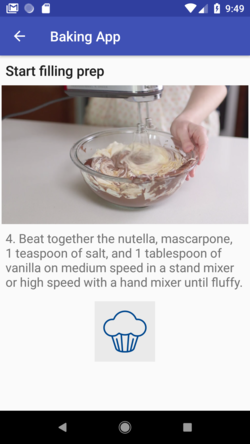

# Baking-App
- Fetch recipes data throught network using **httpURLConnection**
- Handle deserialization JSON data using **Google/GSON** library
- Preview data by using **Recycler view**
- Handle Images download and store by **Picasso** 
- Use **Fragments** to create a responsive design that works on phones and tablets
- Use **Exoplayer** to display videos
- Add a **Configurable Widget** to your app experience
- Handle error cases in UI by using **Espresso**

## Usage Library

- [Picasso](https://square.github.io/picasso/)
- [ExoPlayer](https://github.com/google/ExoPlayer)
- [Espresso](https://developer.android.com/training/testing/espresso/index.html)
- [Butter Knife](http://jakewharton.github.io/butterknife/)
- [Google/GSON](https://github.com/google/gson)

## Screenshots 

  
